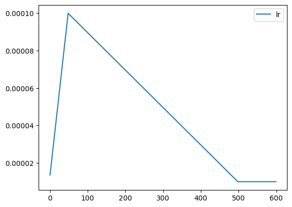

# AnnealingScheduler
- warmup + annealing
- code is copied from [katsura-jp/pytorch-cosine-annealing-with-warmup](https://github.com/katsura-jp/pytorch-cosine-annealing-with-warmup/tree/master)
- if exceed total steps, use last_lr (mode is not None) or max_lr (mode is linear or cosine)

```python
import torch
import pandas as pd
from scheduler import AnnealingWarmupScheduler

model = torch.nn.Linear(100, 10)
optim = torch.optim.AdamW(model.parameters(), lr=1e-4)

total_steps = 500
warmup_steps = 0
scheduler = AnnealingWarmupScheduler(
  optim,
  total_steps,
  max_lr=1e-4,
  last_lr=1e-5,
  warmup_steps=warmup_steps,
  mode="cosine" # None, linear, cosine
)

rows = []

for i in range(total_steps + 100):
    scheduler.step()
    rows.append(scheduler.get_lr()[0])

df = pd.DataFrame({
    "lr": rows
})
df.plot.line(y="lr")
```

### mode=None

### mode="linear"

### mode="cosine"


